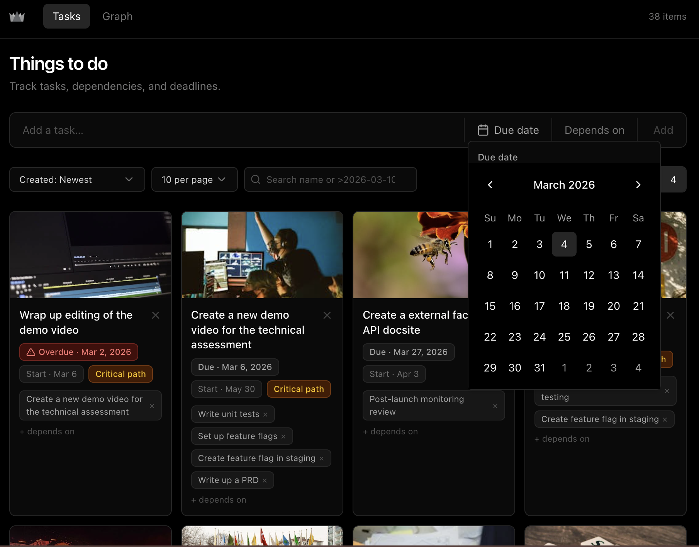
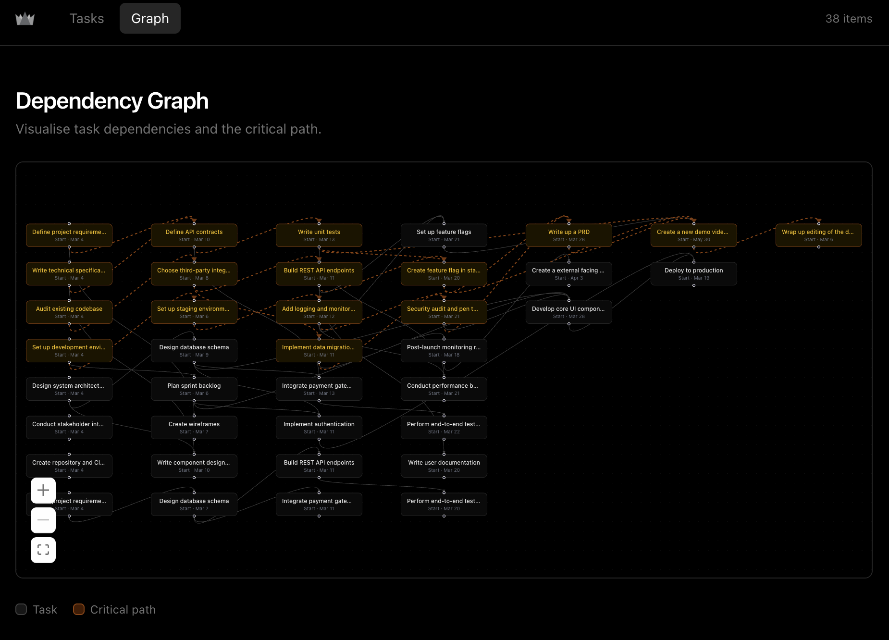

## Soma Capital Technical Assessment

This is a technical assessment as part of the interview process for Soma Capital.

> [!IMPORTANT]  
> You will need a Pexels API key to complete the technical assessment portion of the application. You can sign up for a free API key at https://www.pexels.com/api/

To begin, clone this repository to your local machine.

## Development

This is a [NextJS](https://nextjs.org) app, with a SQLite based backend, intended to be run with the LTS version of Node.

To run the development server:

```bash
npm i
npm run dev
```

## Task:

Modify the code to add support for due dates, image previews, and task dependencies.

### Part 1: Due Dates

When a new task is created, users should be able to set a due date.

When showing the task list is shown, it must display the due date, and if the date is past the current time, the due date should be in red.

### Part 2: Image Generation

When a todo is created, search for and display a relevant image to visualize the task to be done.

To do this, make a request to the [Pexels API](https://www.pexels.com/api/) using the task description as a search query. Display the returned image to the user within the appropriate todo item. While the image is being loaded, indicate a loading state.

You will need to sign up for a free Pexels API key to make the fetch request.

### Part 3: Task Dependencies

Implement a task dependency system that allows tasks to depend on other tasks. The system must:

1. Allow tasks to have multiple dependencies
2. Prevent circular dependencies
3. Show the critical path
4. Calculate the earliest possible start date for each task based on its dependencies
5. Visualize the dependency graph

## Submission:

1. Add a new "Solution" section to this README with a description and screenshot or recording of your solution.
2. Push your changes to a public GitHub repository.
3. Submit a link to your repository in the application form.

## Thanks for your time and effort. We'll be in touch soon!

## Solution

**Demo video**: [Watch on Loom](https://www.loom.com/share/0f8b2b9d89564cbfb988080db2b09be0)

<table><tr><td></td><td></td></tr></table>

### Part 1: Due Dates

Added a `DatePicker` component to the task creation form and inline on each card. Due dates are stored in SQLite via Prisma and displayed on every `TodoCard`; dates in the past render in red with an overdue warning icon. Users can update or clear a due date at any time directly from the card.

### Part 2: Image Generation

On creation, the API fires a background Pexels search using the task title as the query and saves the returned image URL to the database. The `TodoCard` shows a pulsing skeleton while the image is absent or loading. After creation, the client polls the API every second (up to 5 times) so the image appears automatically once the background fetch completes, without requiring a manual refresh.

### Part 3: Task Dependencies

Tasks support multiple dependencies, assignable at creation time or toggled inline on each card. Before adding a dependency, the client runs a BFS cycle check to prevent circular dependency chains; the server also validates on creation. `app/lib/todos.ts` implements a longest-path algorithm to compute the earliest possible start date for each task and identify which tasks lie on the critical path (highlighted with an amber badge). The full dependency graph is visualised with React Flow at `/graph`.

### Additional improvements

- **Logo** SomaCap's logo and favicon, aligning with the overall technical assessment
- **Search & filtering** — live search bar filters tasks by title or by due date using operator expressions (e.g. `>2026-03-10`, `<=2026-04-01`).
- **Pagination & per-page control** — tasks are paginated with configurable page sizes (5 / 10 / 20 / 50 / 100) to keep the list manageable at scale.
- **Multi-column layout** — a 1–4 column toggle switches between a compact list and a card grid, with the image displayed as a full-width banner in grid mode and a thumbnail in list mode.
- **Inline editing** — due dates and dependencies can be updated or cleared directly on each card without opening a separate form.
- **Image refresh** — a per-card refresh button re-fetches a new Pexels image on demand, useful when the initial result isn't relevant.
- **Sorting** — tasks can be sorted by creation date (newest / oldest) or due date (earliest / latest).
- **Local-date handling** — due dates are parsed in local time rather than UTC to avoid off-by-one day errors across timezones.
- **Dark Vercel-style theme** — consistent dark UI using Tailwind + shadcn/ui primitives (neutral palette, subtle borders, amber critical-path accents).
- **Quality of life improvements**:
  - Deletes require an explicit confirmation, prevents accidental deletion
  - Due dates can be updated after the task is created, directly from the `TodoCard`
  - New dependencies can be added from a neat dropdown embedded into the `TodoCard`
  - Previously connected dependencies can be removed from the `TodoCard`
  - Human Readable IDs: although not used directly, these can be used to reference any task without having to look up numeric IDs
- **Repo/Dev specific improvements**:
  - Pruned unused npm packages, added some thoughtful build optimizations
  - Added files to `.gitignore` and removed them from Git tracking. This ensures that we are not storing our entire DB on Github, for instance.
  - Added a `CLAUDE.md` file for future developers to use
  - Added a `seed.js` script to seed database entries with some test values to help get started
  - Added a `SKILL.md` file for claude to use a custom skill to execute the `seed.js` script on your behalf
